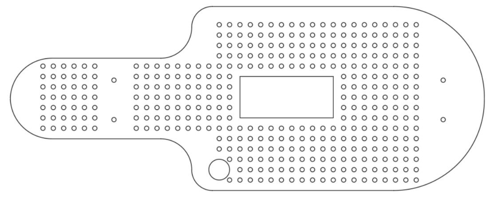
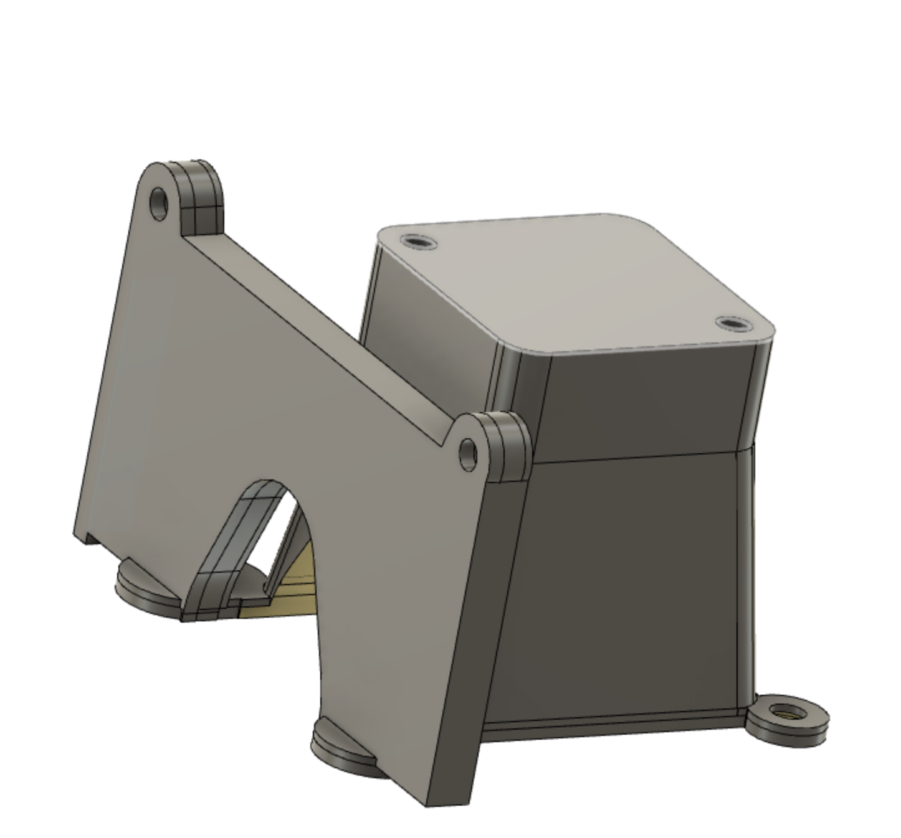
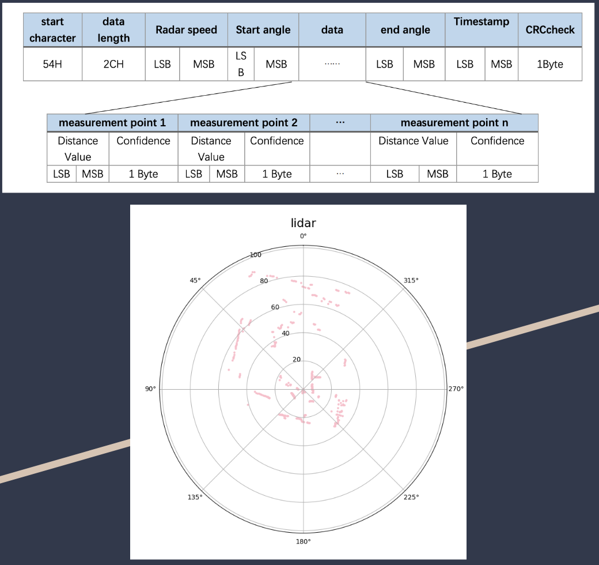

<!-- PROJECT LOGO -->
 

  

  <h3 align="center">ECE/MAE 148 Winter 2023 Team 9</h3>
    
  

    <li>JetBuddy</li>
    <li>Indoor Delivery Bot based on DepthAI, OpenCV and LiDAR</li>
  

<!-- TABLE OF CONTENTS -->

  
<b>Table of Contents</b>

    <li><a href="#team-members">Team Members</a></li>
    <li>
      <a href="#hardware">Hardware and Schematics</a>
      <ul>
        <li><a href="#parts">Parts</a></li>
        <li><a href="#schematics"> Schematics</a></li>
      </ul>
    </li>
    <li><a href="#donkey">Donkey</a></li>
    <li><a href="#final-project">Final Project</a></li>
     <ul>
        <li><a href="#abstract">Abstract</a></li>
        <li><a href="#part-1-human-detection-and-following-with-depthai-and-pyvesc">Part 1: Human Detection and Following with Depthai and PyVesc</a></li>
        <li><a href="#part-2-stopping-mechanism-with-lidar"> Part 2: Stopping Mechanism with Lidar</a></li>
        <li><a href="#part-3-facial-recognition"> Part 3: Facial Recognition</a></li>
      </ul>
     <li><a href="#reflection">Reflection</a></li>
     <ul>
        <li><a href="#challenges">Challenges</a></li>
        <li><a href="#potential-improvements"> Potential Improvements</a></li>
      </ul>
    <li><a href="#presentations">Presentation Files</a></li>
    <li><a href="#reference">Reference</a></li>

<!-- ABOUT THE TEAM -->

## Team members

* Ben Zhang (ECE)
* Joseph Katona (ECE) 
* Yichen Yang (ECE)
* Zijian Wang (MAE)

<!-- ABOUT THE PROJECT HARDWARE -->
## Hardware

(<a href="#readme-top">back to top</a>)

### Parts

#### Full Assembly

(<a href="#readme-top">back to top</a>)

#### Mounting Plate

#### Jetson Case

#### Camera LiDAR Mount

#### Final Project Delivery Box

### Schematics

### Wire Diagram

(<a href="#readme-top">back to top</a>)

<!-- Final Project -->
## Final Project

### Abstract
This project aims to develop a delivery system for our robocar that can detect and follow humans while also incorporating a stopping mechanism to prevent collisions. Additionally, the robot will utilize facial recognition to identify individuals and personalize interactions.

### Part 1: Human Detection and Following with Depthai and PyVesc 
The OAKD camera will be used to detect and track humans in the robot's vicinity. The PyVesc motor controllers will then be used to move the robot in the direction of the detected human.

### Part 2: Stopping Mechanism with Lidar 

The Lidar sensor will be used to detect obstacles in the robot's path. If an obstacle is detected, the robot will stop moving and wait for the obstacle to clear before continuing on its path.

#### The LiDAR on this robot aim to

* Detect anything that is in a close range
* If the position is too clase, the robot will stop to avoid collision
* The robot will back up after it stop for a while and still detect obstacle is close
* Transform raw binary data from LiDAR to numerical data through BinASCII library

#### How to read LiDAR?

* Each measurement data point of LiDAR is consists of a distance value of 2 bytes and a confidence of 1 byte
* We transform this data through chopping it to bytes and translate it.
* We get the angle by getting the start angle and end angle.

* Putting all the distance into a list and it will stop the car if there’s an object within certain distance that LiDAR detected.

### Part 3: Facial Recognition  
The robot will be equipped with a facial recognition system, using a webcam, that will allow it to identify individuals and personalize interactions. Once it recognizes the right person, the delivery box will open.

## Gantt Chart

## Demonstrations

The Video might not show up, please go to img folder for full demo.

<video width=80% controls>
  <source src="img/demo1.mov" type="video/mov">
  <source src="img/demo2.MOV" type="video/mov">
  <source src="img/demo3.mp4" type="video/mp4">
  Your browser does not support HTML video.
</video>

## Reflection

### Challenges

* Getting everything to work together
    - Different libraries working together and all send signals to PyVESC
* Scope of the original idea
    - Mapping the path for future references using SLAM
* Depth ai pipeline caused crashes
    - X-Link Problem(Serial bus issues)
* Translate raw LiDAR output to data we need
* Making the car look smooth
* Better algorithm to adjust speed(rpm)

### Potential Improvements

* Implement all the features together flawlessly
    - Currently cannot run together good due to delay from different components

* Get the locking mechanism working
    - Locking mechanism to make sure the right receiver get the package
* LiDar also scans the path for future path planning
    - Trying to find a person if it cannot detect anything

Maybe try different frameworks since we can use different libraries without limitation in ROS or donkeycar

## Presentations

 <li><a href="https://docs.google.com/presentation/d/1vZR8SQN1TiYbnnbAlBYmKsXzOSSQFPH9sE0spc0SiLc/edit?usp=sharing">Project Proposal & Progress Report</a></li>
  <li><a href="https://docs.google.com/presentation/d/1nHktegokEYfigWinu62BJ4joUQMxiHzlaY9nhIGGi0c/edit?usp=sharing">Final Presntation</a></li>

## Reference

We would like to give special thanks to:

* Professor Jack Silberman
* TA Moises Lopez
* TA Kishore Nukala
* All The teams that helped us on the way
